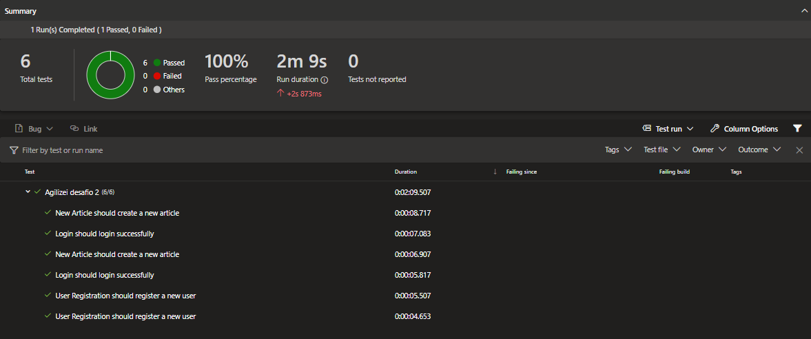

# Agilizei Bootcamp - Challenge 2

The challenge is to complement the tests made on the Level 2 of the bootcamp, which we learned page objects, background login, multibrowser and pipelines on Azure DevOps.

The application to test is [conduit](https://demo.realworld.io/#/) and the pages tested are:

- User registration
- Login
- New article

## Videos/Screenshots

### User registration

### Login

### New article

### Test results on Azure DevOps

## How to run

Clone the repository:

`git clone https://github.com/gmcotta/agilizei-desafio2.git`

Install the dependencies:

`npm install`

To open Cypress:

`npm run cy:open`

To run tests in headless mode on Electron:

`npm run cy:run-electron`

To run tests in headless mode on Chrome:

`npm run cy:run-chrome`

To run tests in headless mode on Firefox:

`npm run cy:run-firefox`

To run tests in headless mode on Edge:

`npm run cy:run-edge`
